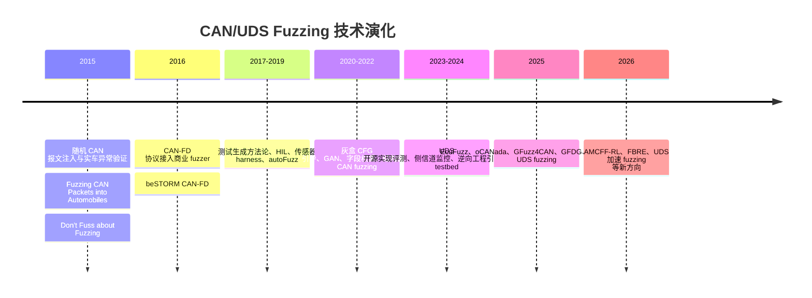
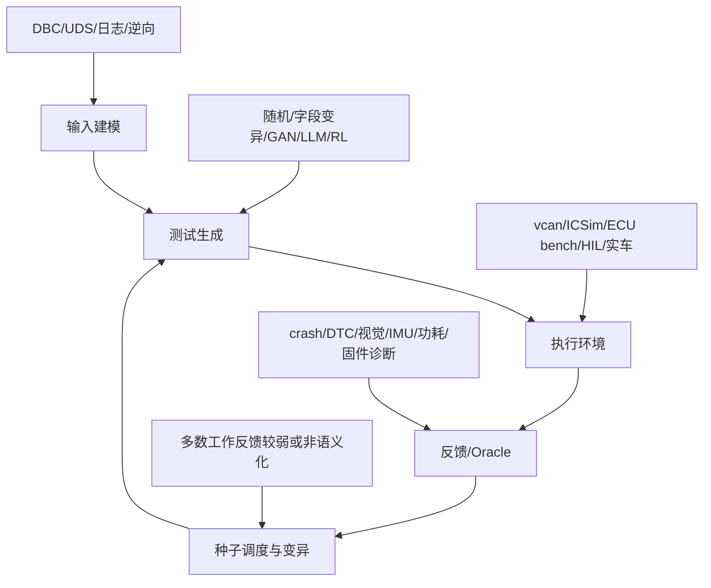
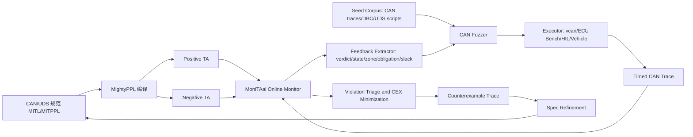

# 2026 年以前及 2026 年上半年 CAN 总线 Fuzzing 文献综述

> 覆盖范围：以 Google Scholar 检索式为发现主线，结合 DOI、出版社页面、DBLP、arXiv、GitHub、作者主页和公开 PDF 进行核验。时间覆盖截至 2026-06-16 已公开的相关工作。无法核实的信息统一标注为“未确认”“未找到公开证据”或“需人工复核”。

## 摘要

CAN 总线 fuzzing 研究经历了从随机 CAN 报文注入、诊断协议变异、DBC/字段结构感知、侧信道反馈，到生成模型、LLM、深度强化学习与固件诊断反馈引导的演进。早期工作主要证明“车辆 CAN 网络能被模糊报文触发异常”，代表如 *Fuzzing CAN Packets into Automobiles*、*Fuzz Testing for Automotive Cyber-Security*；中期工作转向工程化自动测试和真实 ECU/车辆台架，如 autoFuzz、EffCAN、Structure-Aware CAN Fuzzing；近年则出现 EcuFuzz、oCANada、GFuzz4CAN、GFDG、AMCFF-RL 等更强反馈或生成式方法。总体上，现有工具仍普遍存在三个痛点：缺少时序语义 oracle、黑盒 ECU 难获得 coverage、实验复现依赖专有车辆/DBC/固件/商业工具。本文建议基于 MightyPPL + MoniTAal 发展 **M2Fuzz: Monitor-in-the-Loop Timed-Automata-Guided CAN Fuzzing**，用 MITL/MITPPL 自动机状态、DBM frontier、deadline slack 和 pending obligation 作为 fuzzing 搜索梯度，形成“测试发现行为，监控约束行为，自动机状态引导测试，反例 trace 修正规范”的闭环。

## 引言

车载 CAN/CAN-FD 网络缺少原生认证和源身份校验，攻击者一旦通过 OBD、诊断接口、网关或受控 ECU 进入车内网络，就可能注入伪造报文、扰乱诊断状态、触发异常控制逻辑。Fuzzing 因为能在未知协议和黑盒 ECU 场景下系统探索异常输入，逐渐成为汽车网络安全验证的重要技术。

但 CAN fuzzing 与普通软件 fuzzing 不同：第一，很多 ECU 无源码、无插桩、无 coverage；第二，CAN payload 语义通常依赖私有 DBC 或逆向；第三，异常不一定表现为 crash，可能是仪表盘变化、DTC、响应超时、总线负载、物理执行器状态变化；第四，很多漏洞是时序和状态相关的，例如 UDS session 顺序、response deadline、周期报文 jitter、跨 ECU 联动。正因为如此，CAN fuzzing 的核心挑战不是“如何随机发更多包”，而是“如何知道哪些输入更有语义、更接近违规、更值得继续探索”。

## CAN 总线与车载网络安全背景

CAN 帧通常包括 arbitration ID、DLC 和 payload。Classic CAN payload 最多 8 字节，CAN-FD 可更长。车载诊断常通过 UDS over CAN 或 DoCAN 实现，典型对象包括 diagnostic session control、security access、routine control、read/write data by identifier 等。模糊测试可以作用于不同层：

| 层次 | fuzzing 对象 | 典型异常 |
|---|---|---|
| CAN frame | ID、DLC、payload、发送频率 | bus-off、ECU reset、异常仪表显示 |
| CAN timing | inter-frame delay、周期、jitter | 超时、抢占、状态失配 |
| UDS/OBD-II | service、subfunction、session、安全访问 | NRC 异常、session 崩溃、未授权操作 |
| ECU firmware | 外部 CAN + 内部 SPI/I2C/ADC | 固件故障、诊断错误、控制异常 |
| 系统级 | 多 ECU、网关、HIL/bench/实车 | 跨 ECU 状态不一致、物理风险 |

## 文献检索方法与纳入/排除标准

检索式包括 `CAN bus fuzzing`、`automotive fuzzing CAN`、`in-vehicle network fuzzing`、`CAN protocol fuzzing`、`ECU fuzzing CAN`、`UDS fuzzing automotive`、`OBD-II fuzzing CAN`、`CAN-FD fuzzing`、`2026 CAN fuzzing`、`2026 ECU fuzzing`。Google Scholar 作为发现入口；正式事实以 DOI/出版社页/DBLP/arXiv/PDF/GitHub 交叉验证。

纳入标准：

- 明确提出或使用 CAN/CAN-FD/UDS over CAN/OBD-II/ECU fuzzing 工具、方法、系统或测试框架。
- 2026 年论文纳入截至 2026-06-16 已公开的正式发表、online first、预印本或会议录条目，并标注状态。
- 对“fuzzing 辅助 CAN 逆向”“汽车 fuzzing 平台”作为边界类纳入，但在表格中说明。

排除标准：

- 纯 IDS、纯攻击检测、纯车联网安全综述，不提出或使用 fuzzing。
- 纯 LIN、Automotive Ethernet、V2X fuzzing 且与 CAN/UDS 无明显关系的工作。
- 只有商业宣传页而无学术论文的工具，例如 Defensics、beSTORM、CycurFUZZ，仅在相关论文中作为工具背景引用。

## CAN Fuzzing 历史发展脉络



## 工具与论文总览

| 阶段 | 代表工作 | 技术关键词 | 主要贡献 |
|---|---|---|---|
| 早期黑盒注入 | Lee 2015、Bayer 2015、Fowler 2018 | random/mutation CAN fuzzing | 证明 CAN fuzzing 能触发真实车辆/部件异常 |
| 工程化测试 | Nishimura 2016、Fowler 2019、Werquin 2019 | CAN-FD、HIL、sensor harness、autoFuzz | 将 fuzzing 接入商业工具、实验室台架和自动 oracle |
| 灰盒/结构感知 | EffCAN 2020、CAN-FT 2021、Kim 2022 | CFG、GAN、字段结构、checksum/counter | 降低盲目随机搜索，提高有效输入比例 |
| 反馈与侧信道 | FAMGAN 2022、Powertrace 2022、Side Channel Monitoring 2023、GFDG 2025 | IDS 边界、功耗/温度/IMU、遗传算法 | 用外部观测补足黑盒 ECU 的内部反馈 |
| 诊断/固件/生成式 | Çelik 2024、EcuFuzz 2025、oCANada 2025、GFuzz4CAN 2025、AMCFF-RL 2026 | UDS、DBC、SPI、LLM、DRL | 面向更复杂协议状态和真实 ECU 固件 |

## 实验环境与评价指标分析

| 实验环境 | 使用文献 | 优点 | 缺点 |
|---|---|---|---|
| 仿真/虚拟 CAN/ICSim | Werquin 2019、Çelik 2024、oCANada 2025 | 可重复、安全、低成本 | 与真实 ECU 时序/物理行为有差距 |
| ECU bench/仪表盘/商用部件 | Fowler 2018、EffCAN 2020、EcuFuzz 2025、GFDG 2025 | 更贴近实际部件，风险可控 | 需要硬件、接线、传感器、专有数据 |
| HIL/测试床 | Shift Left 2018、VitroBench 2023、Varghese 2024 | 能模拟系统级环境 | 设备昂贵、配置难复现 |
| 真实车辆 | Lee 2015、Fowler 2018、Kim 2022 | 生态真实，能发现物理异常 | 安全风险高，复现困难，车型依赖强 |
| 固件 + 外设仿真 | EffCAN 2020、EcuFuzz 2025 | 可获得更强诊断/内部反馈 | 需要固件、符号/二进制、硬件改造 |

常见评价指标包括：

- 输入有效率：合法 CAN ID、合法 DLC、语义有效 UDS 请求比例。
- 发现效率：time-to-first-violation、time-to-crash、unique anomalies。
- 覆盖：ID/payload coverage、UDS state coverage、firmware CFG coverage、semantic coverage。
- oracle：crash、ECU reset、DTC、NRC、sensor/IMU/功耗/图像变化、物理执行器异常。
- 安全与成本：bus load、测试时长、硬件成本、是否需真实车辆。

## 算法与创新点分类

| 算法类别 | 代表工作 | 反馈信号 | 局限 |
|---|---|---|---|
| 黑盒随机/变异 | Lee 2015、Bayer 2015、Fowler 2018 | 车辆/部件异常、DTC、人工观察 | 输入空间巨大，语义有效率低 |
| 协议/语法感知 | Patki 2018、Çelik 2024、oCANada 2025 | UDS 响应、DBC/parser | 依赖协议知识或 DBC |
| 结构/字段感知 | Kim 2022、Jia 2022 | counter/checksum/字段权重、侧信息 | 对私有 payload 逆向依赖强 |
| 生成模型 | CAN-FT 2021、FAMGAN 2022、SeqGAN 2024、GFuzz4CAN 2025 | 训练数据分布、IDS/异常检测 | 可能学到正常分布但缺少安全语义 oracle |
| 灰盒/固件引导 | EffCAN 2020、EcuFuzz 2025 | CFG、DTC、error variable、exception context | 需要固件和复杂硬件环境 |
| 侧信道/多模态 | Powertrace 2022、Side Channel 2023、GFDG 2025、AMCFF-RL 2026 | 功耗、温度、IMU、实时响应 | 硬件部署和泛化困难 |
| LLM/AI 辅助 | Kayas 2023、McShane 2025、AMCFF-RL 2026 | 日志分类、prompt 生成、RL reward | 可解释性和复现性仍弱 |

## 开源可复现性分析

| 可复现等级 | 代表工作 | 依据 |
|---|---|---|
| 较高 | Werquin/autoFuzz、EcuFuzz | autoFuzz 与 CaringCaribou 相关；EcuFuzz 论文声明代码和实验数据可用 |
| 中 | Çelik 2024、oCANada 2025 | 使用开源 UDS 实现、SocketCAN/ICSim/DBC，但研究脚本或完整日志未必公开 |
| 低 | Lee 2015、Fowler 2018/2019、EffCAN 2020、Kim 2022、GFDG 2025 | 依赖真实车辆/ECU/固件/传感器/商业工具，代码和数据多未公开 |
| 未确认 | 2026 AMCFF-RL、FBRE、BB-FAST | 截至检索时未找到公开代码/数据；部分需正式正文复核 |

关键结论是：CAN fuzzing 的不可复现性通常不是算法伪代码缺失，而是缺少目标 ECU、DBC、固件、传感器安装方式、商业工具配置、真实 trace 和安全实验条件。

## 现有工作的优缺点

优点：

- 已经覆盖随机、语法、结构、生成模型、灰盒、侧信道、诊断反馈等多条路线。
- 真实 ECU/车辆实验逐渐增多，尤其 Kim 2022、EffCAN、EcuFuzz、GFDG 等工作推动了物理有效性。
- UDS fuzzing 开始重视开源生态和可重复 testbed，Çelik 2024 是重要节点。

缺点：

- 多数工具仍把时间当作随机 delay，而不是核心搜索变量。
- oracle 依赖 crash/DTC/视觉/传感器变化，难判断“异常但非漏洞”和“真实安全违规”。
- 很少利用形式化时序规范和自动机状态作为 coverage。
- 复现性弱，代码、trace、DBC、固件和实验脚本公开不足。
- 监控多数是事后判定或外部观察，尚未成为 fuzzing 搜索策略的一部分。

## 研究现状总结



目前 CAN fuzzing 已从“能不能 fuzz”进入“如何有效、可解释、可复现地 fuzz”。下一阶段的核心竞争点会是：状态感知、时序感知、语义 oracle、复现实验基准、以及安全约束下的自动探索。

## 未来趋势

1. 从报文字段 fuzzing 转向 CAN timed trace fuzzing。
2. 从 crash/DTC oracle 转向形式化属性 + 物理观测的复合 oracle。
3. 从随机/生成模型输入转向状态覆盖、自动机覆盖、协议路径覆盖。
4. 从单 ECU fuzzing 转向跨 ECU、网关、诊断链路和系统级 HIL。
5. 从闭源工业工具转向可复现实验基准、开源 trace 和标准化 artifact。

## 面向 MightyPPL + MoniTAal 的创新方案

### 主创新点

**M2Fuzz: Monitor-in-the-Loop Timed-Automata-Guided CAN Fuzzing**

用 MITL/MITPPL 描述 CAN/UDS 行为规范、ECU 响应时间窗口、非法状态转移和安全属性；MightyPPL 将规范编译为 timed automata；MoniTAal 在线监控 fuzzing 生成的 CAN timed traces。不同于“fuzzing 后接监控器”的松散拼接，M2Fuzz 把 monitor 输出变成 fuzzing 的搜索梯度：

- verdict：positive/negative/inconclusive。
- 自动机状态覆盖：哪些规范状态被访问。
- pending obligation：哪些“请求后必须响应”的义务尚未完成。
- deadline slack：距离违反时间边界有多近。
- DBM zone/frontier：当前 timed trace 位于哪些时钟约束区域。
- negative automaton proximity：离接受违规 trace 的路径有多近。

反过来，fuzzing 发现的新 trace 用于发现规范缺口、修正 timing envelope、生成候选 MITL 属性。

### RQ1-RQ4

| RQ | 问题 |
|---|---|
| RQ1 | M2Fuzz 是否比 random/grammar/stateful CAN fuzzer 更快发现时序违规、非法状态转移和 ECU 异常？ |
| RQ2 | 自动机状态覆盖、DBM frontier、deadline slack、pending obligation 各自贡献多少？ |
| RQ3 | MITL monitor-in-the-loop 是否能发现 crash/DTC 之外的非崩溃安全违规，并降低误报？ |
| RQ4 | fuzzing 反例 trace 是否能帮助生成或修正 MITL 规范，从而提升后续 fuzzing 效率？ |

### 系统架构



### 核心算法伪代码

```text
Input: Phi, Seeds, Budget
TA_pos = MightyPPL.compile(Phi)
TA_neg = MightyPPL.compile(!Phi)
Monitor = MoniTAal(TA_pos, TA_neg)
Corpus = Seeds
Violations = []
SpecCandidates = []

while Budget remains:
    seed = select_seed(Corpus)
    fb_old = seed.monitor_feedback
    trace = mutate(seed,
                   target_state=fb_old.unvisited_automata_states,
                   target_timing=fb_old.deadline_frontier,
                   target_obligation=fb_old.pending_obligations)
    observed = execute_on_can_target(trace)
    Monitor.reset()
    feedbacks = []

    for event in observed:
        verdict = Monitor.input(event)
        fb = extract(verdict, automata_state, dbm_zone,
                     pending_obligation, deadline_slack)
        feedbacks.append(fb)
        if verdict == NEGATIVE:
            cex = minimize_counterexample(observed, Phi)
            Violations.append(cex)
            break

    score = semantic_coverage_gain(feedbacks)
          + frontier_score(feedbacks)
          + obligation_pressure(feedbacks)
          - bus_safety_penalty(observed)

    if score > threshold or verdict == NEGATIVE:
        Corpus.add(observed, energy=score)

    if stable_behavior_not_covered_by_Phi(observed):
        SpecCandidates.add(infer_candidate_mitl(observed))

return Violations, Corpus, SpecCandidates
```

### 实验设计与消融

| 实验 | 设计 |
|---|---|
| 基线 | random CAN fuzzer、CaringCaribou/cangen、grammar-based UDS fuzzer、stateful sequence fuzzer |
| 环境 | vcan/SocketCAN、UDS simulator、MoniTAal gear-control benchmark、ECU bench、HIL |
| 指标 | time-to-first-violation、unique violations、semantic coverage、valid message ratio、UDS state coverage、false positive、monitor overhead |
| 消融 | random、syntax-only、monitor-as-oracle、state-feedback-only、timing-frontier-only、no-spec-refinement、full M2Fuzz |

目标投稿：若能在真实 ECU/HIL 上发现新漏洞并开源 artifact，可冲击 USENIX Security/NDSS/IEEE S&P/CCS；若强调“形式化规范反馈驱动 fuzzing”的通用测试方法，ISSTA/ICSE/FSE/ASE 更自然；若强调可靠性和 HIL，DSN/TDSC/TIFS 也合适。

## 结论

CAN fuzzing 的核心缺口已经从“输入生成”转向“语义反馈”。现有 CAN/UDS fuzzing 很多工作能够生成更多、更像真的报文，但很少能解释“为什么这个 trace 重要”“它离违反安全属性还有多远”“下一步应该朝哪个时序边界变异”。MightyPPL + MoniTAal 的价值就在于把 timed automata 变成黑盒 CAN fuzzing 的 coverage 与 oracle。

## 10 条最重要结论

1. 2015-2019 是随机黑盒 CAN fuzzing 与工程化工具验证阶段。
2. 2020 以后开始出现灰盒、结构感知、生成模型和侧信道反馈。
3. 2025-2026 的新工作明显转向 EcuFuzz、oCANada、GFuzz4CAN、GFDG、AMCFF-RL 等更强反馈方法。
4. 大多数论文没有公开完整代码、trace、DBC、固件和实验脚本。
5. 真实车辆实验可信但最难复现，仿真环境可复现但物理有效性不足。
6. UDS fuzzing 是 CAN fuzzing 中最容易标准化和复现的子方向。
7. 生成模型能提高输入有效率，但不能自然提供安全语义 oracle。
8. 侧信道反馈能补足黑盒 ECU coverage，但部署复杂。
9. 现有研究普遍缺少时序语义反馈和状态自动机 coverage。
10. MightyPPL + MoniTAal 可把 MITL timed automata 作为 fuzzing 搜索反馈，这是一个自然且有论文潜力的切入点。

## 5 个最值得做的研究方向

1. Timed-automata-guided CAN/UDS fuzzing。
2. 面向 UDS session/security access 的状态覆盖 fuzzing。
3. 基于 DBC + MITL 的语义 oracle 自动生成。
4. CAN fuzzing 标准 benchmark：vcan、ICSim、开源 UDS server、可公开 trace。
5. 黑盒 ECU 的多模态反馈融合：DTC、timing、功耗、IMU、视觉、自动机状态。

## 最推荐推进的论文方案

**Monitor-in-the-loop fuzzing for timed automotive protocols: using MITL automata frontier as semantic feedback for black-box CAN/UDS fuzzing.**

工作流是：建模 CAN/UDS 时序规范 -> MightyPPL 编译 TA -> MoniTAal 在线监控 fuzz trace -> 提取自动机状态/DBM frontier/deadline slack/pending obligation -> 反馈给 fuzzer 做 seed scheduling 和 timing mutation -> 反例 trace 反向修正规范。这个方案针对现有 CAN fuzzing 缺少 coverage、缺少时序 oracle、缺少状态反馈的核心痛点，不是工具拼接，而是监控与测试的闭环融合。

## 参考文献与证据来源

- Lee et al., *Fuzzing CAN Packets into Automobiles*, IEEE AINA 2015, DOI: https://doi.org/10.1109/AINA.2015.274
- Nishimura et al., *Implementation of the CAN-FD Protocol in the Fuzzing Tool beSTORM*, IEEE ICVES 2016, DOI: https://doi.org/10.1109/ICVES.2016.7548161
- Fowler et al., *Fuzz Testing for Automotive Cyber-Security*, DSN-W 2018, DOI: https://doi.org/10.1109/DSN-W.2018.00070
- Patki et al., *Intelligent Fuzz Testing Framework for Finding Hidden Vulnerabilities in Automotive Environment*, ICCUBEA 2018, DOI: https://doi.org/10.1109/ICCUBEA.2018.8697438
- Fowler et al., *A Method for Constructing Automotive Cybersecurity Tests, a CAN Fuzz Testing Example*, QRS-C 2019, DOI: https://doi.org/10.1109/QRS-C.2019.00015
- Werquin et al., *Automated Fuzzing of Automotive Control Units*, SIOT 2019 / arXiv 2021, https://arxiv.org/abs/2102.12345
- Radu and Garcia, *Grey-box Analysis and Fuzzing of Automotive Electronic Components via Control-Flow Graph Extraction*, ACM CSCS 2020, DOI: https://doi.org/10.1145/3385958.3430480
- Zhang et al., *CAN-FT: A Fuzz Testing Method for Automotive Controller Area Network Bus*, IEEE CISAI 2021, DOI: https://doi.org/10.1109/CISAI54367.2021.00050
- Kim et al., *Efficient ECU Analysis Technology Through Structure-Aware CAN Fuzzing*, IEEE Access 2022, DOI: https://doi.org/10.1109/ACCESS.2022.3151358
- Li et al., *GAN model using field fuzz mutation for in-vehicle CAN bus intrusion detection*, Mathematical Biosciences and Engineering 2022, DOI: https://doi.org/10.3934/mbe.2022330
- Çelik et al., *Comparing Open-Source UDS Implementations Through Fuzz Testing*, SAE 2024, DOI: https://doi.org/10.4271/2024-01-2799
- Chen et al., *Structure-Aware, Diagnosis-Guided ECU Firmware Fuzzing*, PACMSE/ISSTA 2025, DOI: https://doi.org/10.1145/3728914
- Santos et al., *oCANada: A Generation-Based Fuzzer for ECUs over CAN*, IEEE VNC 2025, DOI: https://doi.org/10.1109/VNC64509.2025.11054197
- McShane et al., *LLM-Powered Fuzz Testing of Automotive Diagnostic Protocols*, SAE 2025, DOI: https://doi.org/10.4271/2025-01-8091
- Varghese et al., *AMCFF-RL: An Adaptive Multi-Modal CAN Bus Fuzzing Framework Leveraging Deep Reinforcement Learning*, IEEE Open Journal of Vehicular Technology 2026, DOI: https://doi.org/10.1109/OJVT.2026.3659052
- CCF 目录核验：ISSTA 为软件工程 A 类；DSN 为网络与信息安全 B 类；ICC 为计算机网络 C 类；QRS 为软件工程 C 类。参考 CCF 页面与目录检索： https://www.ccf.org.cn/Academic_Evaluation/TCSE_SS_PDL/ ，https://www.ccf.org.cn/Academic_Evaluation/NIS/ ，https://ccf.atom.im/

## 2026-06-16 前 CAN 总线 Fuzzing 相关文献与工具总览表

| 序号 | 文献名 | 发表时间 | 作者 | 会议/期刊等级 | 算法和创新点 | 实验背景 | 实验效果 | 是否开源代码 | 可复现性 | 主要优点 | 主要缺点 | 证据链接 |
|---|---|---|---|---|---|---|---|---|---|---|---|---|
| 1 | Fuzzing CAN Packets into Automobiles | 2015-03 | Hyeryun Lee, Kyunghee Choi, Kihyun Chung, Jaein Kim, Kangbin Yim | IEEE AINA；CCF 未确认 | 黑盒随机/变异 CAN ID/DLC/payload 注入 | 车辆 CAN 环境，公开细节有限 | 后续文献引用其展示 CAN fuzzing 可触发异常 | 未找到公开代码 | 低 | 早期直接面向 CAN 的实证工作 | 随机性强、复现材料少 | https://doi.org/10.1109/AINA.2015.274 |
| 2 | Don’t Fuss about Fuzzing: Fuzzing Controllers in Vehicular Networks | 2015，月份未确认 | Stephanie Bayer, Alexander Ptok | escar Europe；非 CCF/工业会议 | 车载控制器 fuzzing | 车载控制器/ECU，细节需复核 | 被 Werquin、SAE UDS 等后续工作引用 | 未找到公开代码 | 低 | 早期工业界车载控制器 fuzzing | 原文和 artifact 难获取 | https://arxiv.org/html/2102.12345v2 |
| 3 | Implementation of the CAN-FD Protocol in the Fuzzing Tool beSTORM | 2016-07 | Ryosuke Nishimura, Ryo Kurachi, Kazumasa Ito, Takashi Miyasaka, Masaki Yamamoto, Miwako Mishima | IEEE ICVES；非 CCF/未确认 | 将 CAN-FD 协议接入商业 fuzzing 工具 beSTORM | PCAN-USB FD、PCAN-View、CAN-FD bus | 主要验证 CAN-FD fuzz 数据发送与吞吐/时间 | beSTORM 非开源 | 低 | 早期 CAN-FD fuzz 工具集成 | 商业工具依赖强，漏洞发现弱 | https://doi.org/10.1109/ICVES.2016.7548161 |
| 4 | Automating Fuzz Test Generation to Improve the Security of the Controller Area Network | 2017，月份未确认 | Daniel S. Fowler, Jeremy Bryans, Siraj Shaikh | ACM CSCS 2017；等级未确认 | CAN fuzz test 自动生成方法 | 车载 CAN 安全测试，细节需复核 | 作为后续 Fowler CAN fuzzer 方法前身 | 未找到公开代码 | 低 | 强调从设计/规范生成测试 | 出版和实验细节需复核 | https://pure.coventry.ac.uk/ws/portalfiles/portal/11566144/Fowler_Bryans_Shaikh_ECU_Fuzz_Testing.pdf |
| 5 | Automatically Generating Fuzz Tests from Automotive Communication Databases | 2017，月份未确认 | P. Lapczynski, H. Heinemann, T. Schöneberger, E. Metzker | escar USA；非 CCF/工业会议 | 基于汽车通信数据库/DBC 自动生成 fuzz tests | 通信数据库驱动，细节需复核 | 未找到公开效果细节 | 未找到公开代码 | 低 | 利用已有 DBC/通信规范 | 公开资料有限 | https://escar.info/escar-usa/papers |
| 6 | Fuzz Testing for Automotive Cyber-Security | 2018-06 | Daniel S. Fowler, Jeremy Bryans, Siraj A. Shaikh, Paul Wooderson | DSN-W；DSN 主会 CCF B，workshop 非主会 | 自研 C# CAN fuzzer，黑盒变异 | Vector 仿真、PCAN-USB、仪表盘、真实车辆、Arduino CAN bench | 触发 MIL、告警、转速异常；bench 解锁平均 431s，加入 DLC 检查后 1959s | 未找到公开代码 | 低 | 实验环境丰富，含真实车辆和 bench | 可能损坏部件，代码/trace 未公开 | https://doi.org/10.1109/DSN-W.2018.00070 |
| 7 | Shift Left: Fuzzing Earlier in the Automotive Software Development Lifecycle Using HIL Systems | 2018，月份未确认 | Toshiyuki Fujikura, Ryo Kurachi, Daisuke K. Oka 等，作者需复核 | escar Europe；非 CCF/工业会议 | 将 fuzzing 前移到 HIL 测试流程 | 汽车 HIL 系统 | 公开效果需复核 | 未找到公开代码 | 低 | 强调开发早期安全测试 | 更偏工程流程 | https://www.researchgate.net/publication/330384207_Shift_Left_Fuzzing_Earlier_in_the_Automotive_Software_Development_Lifecycle_using_HIL_Systems |
| 8 | Intelligent Fuzz Testing Framework for Finding Hidden Vulnerabilities in Automotive Environment | 2018-08 | Pranav Patki, Ajey Gotkhindikar, Sunil Mane | IEEE ICCUBEA；非 CCF/未确认 | UDS/CAN 协议感知变异，DLC/subfunction/全 0/全 FF | 专有 ECU/UDS，细节需复核 | 实验效果未能公开核验 | 未找到公开代码 | 低 | 比纯随机更贴近诊断协议 | 代码、数据、实验细节不足 | https://doi.org/10.1109/ICCUBEA.2018.8697438 |
| 9 | A Method for Constructing Automotive Cybersecurity Tests, a CAN Fuzz Testing Example | 2019-07 | Daniel S. Fowler, Jeremy Bryans, Madeline Cheah, Paul Wooderson, Siraj A. Shaikh | IEEE QRS-C；QRS 主会 CCF C，companion 需复核 | 汽车安全测试构造方法 + CAN fuzzer 示例 | 实验室车辆显示 ECU、prototype CAN fuzzer | 摘要称揭示 ECU bug 和系统设计弱点 | 未找到公开代码 | 低 | 方法论清晰，工程流程强 | 算法贡献较弱，复现材料少 | https://doi.org/10.1109/QRS-C.2019.00015 |
| 10 | Automated Fuzzing of Automotive Control Units | 2019-09；arXiv 2021 | Timothy Werquin, Mathijs Hubrechtsen, Ashok Thangarajan, Frank Piessens, Jan Tobias Mühlberg | SIOT；非 CCF/未确认 | autoFuzz + sensor harness + oracle | VulCAN、ICSim、商用仪表盘、USB-CAN、光/颜色传感器 | VulCAN 中数分钟发现多个漏洞；11-bit ID 枚举约 30s | 部分开源，CaringCaribou autoFuzz 分支 | 中 | 自动化 oracle 和传感器反馈 | 依赖硬件和传感器校准 | https://arxiv.org/abs/2102.12345 |
| 11 | Grey-box Analysis and Fuzzing of Automotive Electronic Components via Control-Flow Graph Extraction | 2020-12 | Andreea-Ina Radu, Flavio D. Garcia | ACM CSCS；非 CCF/未确认 | EffCAN；固件 CFG 静态分析引导 CAN fuzzing | 3 个真实 ECU、PCAN-USB、固件 CFG | 3 个 ECU 中 2 个 crash；可触发仪表灯/指针 | 未找到公开代码 | 低 | 引入灰盒固件结构反馈 | 需要固件和目标 ECU，复现门槛高 | https://doi.org/10.1145/3385958.3430480 |
| 12 | Vulnerability-Oriented Fuzz Testing for Connected Autonomous Vehicle Systems | 2021，月份未确认 | Lama J. Moukahal, Mohammad Zulkernine, Martin Soukup | IEEE Transactions on Reliability；分区需复核 | VulFuzz；漏洞指标引导 CAV fuzzing | CAV 系统软件，非 CAN 专属 | 提升高风险组件测试效率，具体需正文复核 | 未找到公开代码 | 低 | 风险导向 | 与 CAN/UDS 关联较间接 | https://dblp.org/rec/journals/tr/MoukahalZS21.html |
| 13 | Boosting Grey-box Fuzzing for Connected Autonomous Vehicle Systems | 2021，月份未确认 | Lama J. Moukahal, Mohammad Zulkernine, Martin Soukup | IEEE QRS-C；QRS 主会 CCF C，companion 需复核 | VulFuzz++；灰盒 fuzzing + concolic execution | CAV 软件系统 | 用符号执行突破 coverage 停滞，需正文复核 | 未找到公开代码 | 低 | 结合 fuzzing 和 concolic | 不适合纯黑盒 ECU | https://dblp.org/rec/conf/qrs/MoukahalZS21 |
| 14 | CAN-FT: A Fuzz Testing Method for Automotive Controller Area Network Bus | 2021-09 | Haichun Zhang, Kelin Huang, Jie Wang, Zhenglin Liu | IEEE CISAI；非 CCF/未确认 | GAN-based CAN fuzz message generation | CAN bus 测试环境细节需复核 | 官方摘要称用 GAN 生成 CAN fuzz 消息 | 未找到公开代码 | 低 | 尝试生成模型 | 数据/实验/代码未公开 | https://doi.org/10.1109/CISAI54367.2021.00050 |
| 15 | Efficient ECU Analysis Technology Through Structure-Aware CAN Fuzzing | 2022-02 | Hyunghoon Kim, Yeonseon Jeong, Wonsuk Choi, Doonhoon Lee, Hyojin Jo | IEEE Access；非 CCF，JCR/中科院需复核 | 结构感知 CAN fuzzing，checksum/counter/字段结构 | 两台真实车辆、CAN log、IMU/side information | 将部分输入空间从 >2^66 降到 <2^8；观察到转向等误行为 | 未找到公开代码 | 低 | 显著减少盲目搜索 | 数据/脚本未公开，车型依赖 | https://doi.org/10.1109/ACCESS.2022.3151358 |
| 16 | GAN model using field fuzz mutation for in-vehicle CAN bus intrusion detection | 2022-05 | Zhongwei Li, Wenqi Jiang, Xiaosheng Liu, Kai Tan, Xianji Jin, Ming Yang | Mathematical Biosciences and Engineering；分区需复核 | FAMGAN；CRF 字段划分 + Apriori + WGAN-GP | 真实车辆 CAN 数据，IDS 测试 | 生成异常 CAN 消息评估 IDS 边界 | 未找到公开代码 | 低 | 面向 IDS 评估的生成式 fuzz 输入 | 不是直接 ECU 漏洞发现 | https://doi.org/10.3934/mbe.2022330 |
| 17 | Algorithm Research on Fuzzy Test Method of CAN Bus Based on Field Weight | 2022，月份未确认 | Yunhui Jia, Jianhong Yang, Shunkai Wang, Yi Wang, Hongshuo Chen, Zonghao Ma 等 | IEEE PAINE/ICPECA 信息冲突，需复核 | 字段权重变异 | CAN bus fuzzing，细节需复核 | 效果需复核 | 未找到公开代码 | 低 | 关注字段重要性 | 元数据和实验需人工复核 | https://doi.org/10.1109/PAINE56030.2022.10014924 |
| 18 | Powertrace-based Fuzzing of CAN Connected Hardware | 2022，月份未确认 | A. Dunne, S. Fischmeister | IEEE CSR；非 CCF/未确认 | 功耗轨迹 side-channel-guided CAN fuzzing | CAN-connected hardware，功耗测量 | 用功耗轨迹检测系统响应，细节需正文 | 未找到公开代码 | 低 | 能观察 CAN 响应外的内部行为 | 需要功耗采集硬件 | https://uwaterloo.ca/embedded-software-group/references/powertrace-based-fuzzing-can-connected-hardware |
| 19 | Fuzz Testing and Safe Framework Development for Vehicle Security Analysis | 2023，月份未确认 | Tugsmandakh Nyamdelger, Munkhdelgerekh Batzorig, Esam Ali Albhelil, Yeji Koh, Kangbin Yim | IMIS/Springer LNNS；非 CCF/未确认 | vehicle security fuzz testing framework | IVN/CAN vehicle security analysis | 公开细节有限 | 未找到公开代码 | 低 | 关注安全框架 | 正文/配置不足 | https://doi.org/10.1007/978-3-031-35836-4_12 |
| 20 | Side Channel Monitoring for Fuzz Testing of Future Mobility Systems | 2023，月份未确认 | Philipp Fuxen, Murad Hachani, Jonas Schmidt, Philipp Zaumseil, Rudolf Hackenberg | IARIA CLOUD COMPUTING；非 CCF/未确认 | 侧信道监控 + automotive fuzz testing | SocketCAN/can-utils、Scapy、Caring Caribou | 侧信道用于补充 fuzzing monitor | 未找到完整公开代码 | 低 | 强调 monitor 重要性 | 更偏监控框架，实验规模有限 | https://personales.upv.es/thinkmind/CLOUD_COMPUTING/CLOUD_COMPUTING_2023/cloud_computing_2023_1_30_28003.html |
| 21 | VitroBench: Manipulating In-Vehicle Networks and COTS ECUs on Your Bench | 2023，月份未确认 | Anthony K. T. Yeo, Matheus E. Garbelini, Sudipta Chattopadhyay, Jianying Zhou | Vehicular Communications；分区需复核 | COTS ECU bench/test platform，支持 CAN 操作与 fuzzing 类实验 | ECU bench、COTS ECU、传感器反馈 | 降低实车风险，支持更现实台架 | 未找到主工具开源证据 | 中低 | 平台价值高 | 硬件配置难复现 | https://doi.org/10.1016/j.vehcom.2023.100649 |
| 22 | AI-assisted Vulnerability Analysis And Classification Framework for UDS on CAN-bus Fuzzer | 2023-10 | Golam Kayas, Zachariah Pelletier, Douglas Gordon, Tim Arnston, Jamie Payton | escar USA；非 CCF/工业会议 | ML 辅助 UDS-on-CAN fuzz 结果分类 | UDS fuzz logs，工业工具环境 | 自动分类漏洞类别，效果需原文复核 | 未找到公开代码 | 低 | 改善 triage | 更像后处理，非生成闭环 | https://doi.org/10.5281/zenodo.18714709 |
| 23 | Comparing Open-Source UDS Implementations Through Fuzz Testing | 2024-04 | Levent Çelik, John McShane, Christian Scott, Iwinosa Aideyan, Richard Brooks, Mert D. Pesé | SAE Technical Paper；非 CCF | Caring Caribou + Defensics 对开源 UDS 实现 fuzzing | SocketCAN/vcan、PCAN-USB、PCAN-View、8 个开源 UDS server | 发现开源实现功能不足和 surface-level issues | 目标/工具部分开源，研究脚本未找到 | 中 | 可复现基础较好 | 商业 Defensics 不可复现 | https://doi.org/10.4271/2024-01-2799 |
| 24 | Novel CAN Bus Fuzzing Framework for Finding Vulnerabilities in Automotive Systems | 2024-06 | Manu Jo Varghese, Adnan Anwar, Frank Jiang, Robin Doss | DSN-S；DSN 主会 CCF B，supplemental 非主会 | ARE-GF；逆向工程引导 CAN fuzzing | CAN 报文变异并监控 ECU 反应 | 短文，公开效果有限 | 未找到公开代码 | 低 | 从随机转向逆向引导 | 篇幅短，复现不足 | https://doi.org/10.1109/DSN-S60304.2024.00024 |
| 25 | Adaptive Fuzz Testing for Automotive ECUs: A Modular Testbed Approach for Enhanced Vulnerability Detection | 2024-08 | Manu Jo Varghese, Frank Jiang, Robin Doss, Adnan Anwar, Abdur Rakib | ACM SIGCOMM Posters/Demos；SIGCOMM 主会 CCF A，但 demo 非主会 | adaptive fuzzing + modular ECU testbed | 模块化物理 testbed | 展示增强漏洞检测思路，细节有限 | 未找到公开代码 | 低 | 强调物理 testbed | demo 篇幅短 | https://doi.org/10.1145/3672202.3673734 |
| 26 | A Fuzz Testing Method Based on DDPM for Intelligent Connected Vehicles CAN Communication | 2024，月份未确认 | 作者需复核 | SAE Technical Paper；非 CCF | DDPM/diffusion-based CAN fuzzing | 智能网联车 CAN 通信，细节需复核 | 效果需正文复核 | 未找到公开代码 | 低 | 生成模型新路线 | 公开细节有限 | https://saemobilus.sae.org/papers/a-fuzz-testing-method-based-ddpm-intelligent-connected-vehicles-communication-2024-01-7044 |
| 27 | Fuzz Testing of Vehicle CAN Bus Based on Sequence Generative Adversarial Network | 2024，月份未确认 | Guoli Cheng, Jingwei Shang, Lei Yun, Yanjiao Ma, Linfeng Du | IAECST；非 CCF/未确认 | SeqGAN 生成 CAN fuzzing 测试序列 | Vehicle CAN bus，细节需复核 | 效果需正文复核 | 未找到公开代码 | 低 | 关注序列生成 | 代码/数据未公开 | https://doi.org/10.1109/IAECST64597.2024.11117791 |
| 28 | A Fuzz Testing Method for Information Security of Intelligent Connected Vehicles | 2024，月份未确认 | 作者需复核 | Springer book chapter；非 CCF/未确认 | UDS syntax tree mutation | 智能网联车信息安全测试 | 减少无效测试用例，细节需复核 | 未找到公开代码 | 低 | 语法感知 | 章节论文，细节有限 | https://www.springerprofessional.de/en/a-fuzz-testing-method-for-information-security-of-intelligent-co/27421344 |
| 29 | Reverse Engineering-Guided Fuzzing for CAN Bus Vulnerability Detection | 2025-02 online first | Manu Jo Varghese, Frank Jiang, Abdur Rakib, Robin Doss, Adnan Anwar | WISA/LNCS；非 CCF/未确认 | reverse-engineering-guided CAN fuzzing | CAN bus 漏洞检测 | 效果需正文复核 | 未找到公开代码 | 低 | 逆向与 fuzzing 结合更自然 | 复现材料未确认 | https://link.springer.com/chapter/10.1007/978-981-96-1624-4_17 |
| 30 | LLM-Powered Fuzz Testing of Automotive Diagnostic Protocols | 2025，月份未确认 | John McShane, Levent Çelik, Iwinosa Aideyan, Richard Brooks, Mert D. Pesé | SAE Technical Paper；非 CCF | LLM-assisted UDS fuzzer generation | UDS diagnostic protocol，商业 fuzzer 对比 | 比较 AI 生成用例和商业 fuzzer，称发现/报告 zero-day 需复核 | 未找到公开代码 | 低 | 降低 fuzzer 开发门槛 | prompt 敏感，商业依赖 | https://doi.org/10.4271/2025-01-8091 |
| 31 | Structure-Aware, Diagnosis-Guided ECU Firmware Fuzzing | 2025-07 | Qicai Chen, Kun Hu, Sichen Gong, Bihuan Chen, Zikui Kong, Haowen Jiang, Bingkun Sun, You Lu, Xin Peng | PACMSE/ISSTA；ISSTA CCF A | EcuFuzz；CAN + SPI 结构感知，DTC/error variable/exception context 反馈 | 真实 ECU、STM32H755 外设仿真、SPI、UDS Analyzer | 三个主要供应商真实 ECU；论文称发现 9 个未知安全关键故障 | 是，论文声明代码和数据可用 | 中高 | 反馈强、真实 ECU、贡献大 | 硬件和固件复现成本高 | https://doi.org/10.1145/3728914 |
| 32 | oCANada: A Generation-Based Fuzzer for ECUs over CAN | 2025-06 | Thales Santos, Patrick Grümer, Reza Parsamehr, Hugo Pacheco | IEEE VNC；非 CCF/未确认 | DBC/parser generation-based CAN fuzzer | opendbc/cantools、改造 ICSim，与 CaringCaribou/暴力策略比较 | 使用 parser 避免无效报文，效果需正文复核 | 未找到公开代码 | 中低 | 结构正确输入生成 | 代码和实验脚本未公开 | https://doi.org/10.1109/VNC64509.2025.11054197 |
| 33 | GFuzz4CAN: A Generative Model-based Fuzzing Method for In-vehicle Controller Area Network | 2025-06 | Yuhan Wu, Li Lu, Yuli Wu, Kui Ren 等 | IEEE ICC；CCF C | 生成模型 CAN fuzzing | In-vehicle CAN，细节需正文 | 作者页称 IEEE ICC 2025 Best Paper | 未找到公开代码 | 低 | 面向 CAN 的生成式方法 | 代码/数据未确认 | https://doi.org/10.1109/ICC52391.2025.11160828 |
| 34 | GFDG: A Genetic Fuzzing Method for the Controller Area Network Protocol | 2025，月份未确认 | Miguel Stey, Murad Hachani, Philipp Fuxen, Julian Graf, Rudolf Hackenberg | IARIA CLOUD COMPUTING；非 CCF/未确认 | 遗传算法 + side-channel feedback，识别 active CAN IDs | 真实 ECU、温度/电源等侧信道、InfluxDB | 发现异常和 DoS 类中断，细节需正文复核 | 未找到公开代码 | 低 | feedback-based，关注黑盒有效 ID | 侧信道部署复杂 | https://www.iaria.org/conferences2025/filesCLOUDCOMPUTING25/28009_cloudcompSp.pdf |
| 35 | Algorithmic Optimization for Accelerated UDS Fuzzing in Cyber-Physical Automotive Networks: The BB-FAST Approach on LIN-Bus | 2026-03，预印本/MDPI 状态需复核 | 作者需复核 | Electronics/Preprints；非 CCF，状态需复核 | BB-FAST；batch fuzzing + binary search localization | LIN-based UDS 物理 ECU，边界相关非 CAN | 称测试时间降低 55.56% 和 93.44% | 未找到公开代码 | 低 | 低带宽诊断 fuzzing 加速思路 | 主要是 LIN/UDS，不是 CAN 主线 | https://www.mdpi.com/2079-9292/15/6/1223 |
| 36 | AMCFF-RL: An Adaptive Multi-Modal CAN Bus Fuzzing Framework Leveraging Deep Reinforcement Learning | 2026-01-29 | Manu Jo Varghese, Frank Jiang, Abdur Rakib, Robin Doss, Adnan Anwar | IEEE Open Journal of Vehicular Technology；期刊分区需复核 | DRL + 多模态 CAN fuzzing，实时反馈闭环 | Adaptive multi-modal CAN fuzzing framework，细节需正文 | 2026 正式公开；具体实验需正文复核 | 未找到公开代码 | 低 | 与本文 M2Fuzz 最接近的反馈式趋势 | RL 环境/数据未公开，解释性不足 | https://doi.org/10.1109/OJVT.2026.3659052 |
| 37 | FBRE: Fuzzing Based Bit-Level Reverse Engineering of Vehicular CAN Bus | 2026，状态需复核 | 作者需 IEEE 页复核 | IEEE Transactions on Computers；分区/CCF 需复核 | fuzzing-based bit-level CAN reverse engineering | Vehicular CAN bit-level reverse engineering | 非漏洞 fuzzing，辅助 CAN 语义恢复 | 未找到公开代码 | 低 | 对 DBC/语义恢复有价值 | 不是直接漏洞 fuzzing | https://www.computer.org/csdl/journal/tc/2026/04/11313798/2cGzdcICrQI |
